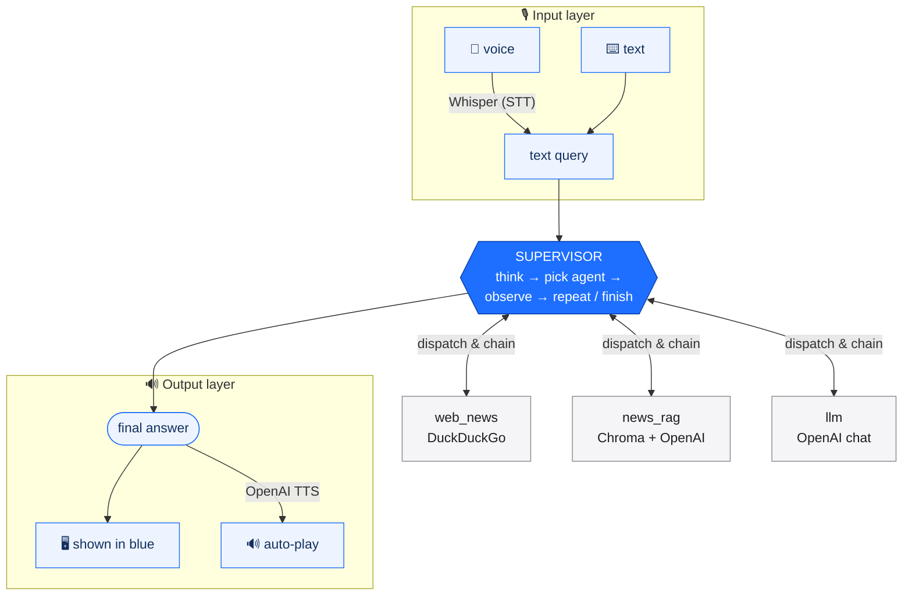

# 🧠 Multi-Agent Supervisor Assistant

A text- and voice-driven assistant where an **LLM supervisor** reasons about each
request, plans, and dispatches it to the right specialist agent — live web-news
search, RAG over a local news database, or a general-purpose LLM — chaining them
across multiple steps when a question needs more than one.

Runs as a **Gradio web UI** with text and voice input and spoken answers.

---

## ✨ Features

- **Supervisor orchestration** — an LLM plans, picks the next agent, observes the
  result, and either calls another agent or finishes. Multi-step and self-synthesizing.
- **Three specialist agents**
  - `web_news` — live, up-to-the-minute news via DuckDuckGo (no API key).
  - `news_rag` — retrieval-augmented answers over a local Chroma vector database.
  - `llm` — general reasoning, explanations, and math.
- **Text or voice** — type a message or speak it (Whisper transcription).
- **Spoken answers** — the answer is rendered in blue **and** synthesized to
  speech (OpenAI TTS) that auto-plays in the browser.
- **Web UI** — Gradio interface with mic input and a live view of the
  supervisor's reasoning trace.

---

## 🏗️ How it works



> Voice wraps the text pipeline on both ends — every turn also works as plain text.

The **supervisor is the only agent** — it holds all the reasoning. The three
workers are intentionally thin: each does one job in a single shot and returns a
string. This keeps them cheap, predictable, and easy to test, while all the
decision-making stays in one auditable place.

Routing is driven by each agent's **description** (registered in
`build_default_assistant()`), which the supervisor reads to choose — not by
hard-coded keywords.

---

## 🎙️ Voice layer

Voice wraps the text pipeline on both ends (see the diagram above), so speech is
fully optional — every turn works with plain text too.

**Input layer (speech → text).** The browser records the microphone
(`gr.Audio(sources=["microphone"])`) and hands the app a `.wav` file. That file
is transcribed to text by OpenAI Whisper (`VoiceAssistant.transcribe_file`).
Typed text, when present, takes priority and skips transcription.

**Output layer (text → speech).** The final answer is shown in blue **and**
synthesized to a `.wav` with OpenAI TTS (`VoiceAssistant.synthesize_to_file`,
`gpt-4o-mini-tts`), returned to a `gr.Audio(autoplay=True)` component that plays
it in the browser.

Because recording and playback happen **in the browser**, no local microphone,
speaker, or audio libraries are required on the server — only network access to
the OpenAI API.

---

## 🚀 Setup

Requires **Python 3.12** and an OpenAI API key.

```bash
# 1. Install dependencies
pip3 install -r requirements.txt

# 2. Configure secrets — create a .env file in the project root:
```

```env
OPENAI_API_KEY=sk-...
```

`OPENAI_API_KEY` powers the LLM, RAG embeddings, Whisper (speech-to-text), and
TTS. No key is needed for DuckDuckGo news search.

---

## ▶️ Usage

### Web UI

```bash
python3 app.py
```

Opens at **http://127.0.0.1:7860** with:

- a text box and a microphone recorder for input,
- the supervisor's reasoning trace,
- the answer in blue, plus a voice clip that auto-plays.

> Browser autoplay may be blocked until you interact with the page once; the
> audio player's play button is always available as a fallback.

### Quick smoke test

Exercises the full supervisor/agent pipeline without a browser:

```bash
python3 -c "from dotenv import load_dotenv; load_dotenv(); \
from VoiceAssistant import build_default_assistant; \
print(build_default_assistant().supervisor.route('What is the latest AI news?'))"
```

### Try these

| Ask                                                  | Routes to                    |
| ---------------------------------------------------- | ---------------------------- |
| `What is 25 times 3?`                                | `llm` (answers directly)     |
| `What is the latest news about SpaceX today?`        | `web_news` (live search)     |
| `Tell me EV battery news and explain why it matters` | `news_rag` → `llm` (chained) |

---

## 📁 Project structure

| Path                          | Role                                                               |
| ----------------------------- | ------------------------------------------------------------------ |
| `Supervisor.py`               | The orchestrating agent: plan → dispatch → observe → repeat.       |
| `OpenAILLM.py`                | Thin `.invoke(prompt)` wrapper over OpenAI Chat Completions.       |
| `agents/BaseAgent.py`         | Abstract base defining the `run(query)` worker contract.           |
| `agents/LLMAgent.py`          | General-purpose LLM worker.                                        |
| `agents/RagAgent.py`          | Retrieves from Chroma and answers over the docs.                   |
| `agents/SearchAgent.py`       | Searches the web and answers over fresh results.                   |
| `Knowledge/knowledge_base.py` | Sample news + `build_news_vector_db()` (persisted Chroma).         |
| `tools/search_tools.py`       | `DuckDuckGoNewsTool` — free news search, fails soft.               |
| `VoiceAssistant.py`           | Whisper/TTS speech helpers and `build_default_assistant()` wiring. |
| `app.py`                      | Gradio web UI — the runnable entry point.                          |

Run commands from the project root so the `agents/`, `Knowledge/`, and `tools/` packages resolve.

---

## 🧩 Architecture notes

- **Adding an agent:** implement `run(query) -> str`, then register it in
  `build_default_assistant()` with a clear `description` — that description is
  how the supervisor decides when to use it.
- **Dependency injection:** every worker receives its backends (LLM, vector DB,
  search tool) in its constructor. An `llm` is anything with `.invoke(prompt) -> str`.
- **Persistence:** the Chroma store is written to `./chroma_db` on first run and
  reused afterward (no re-embedding).
